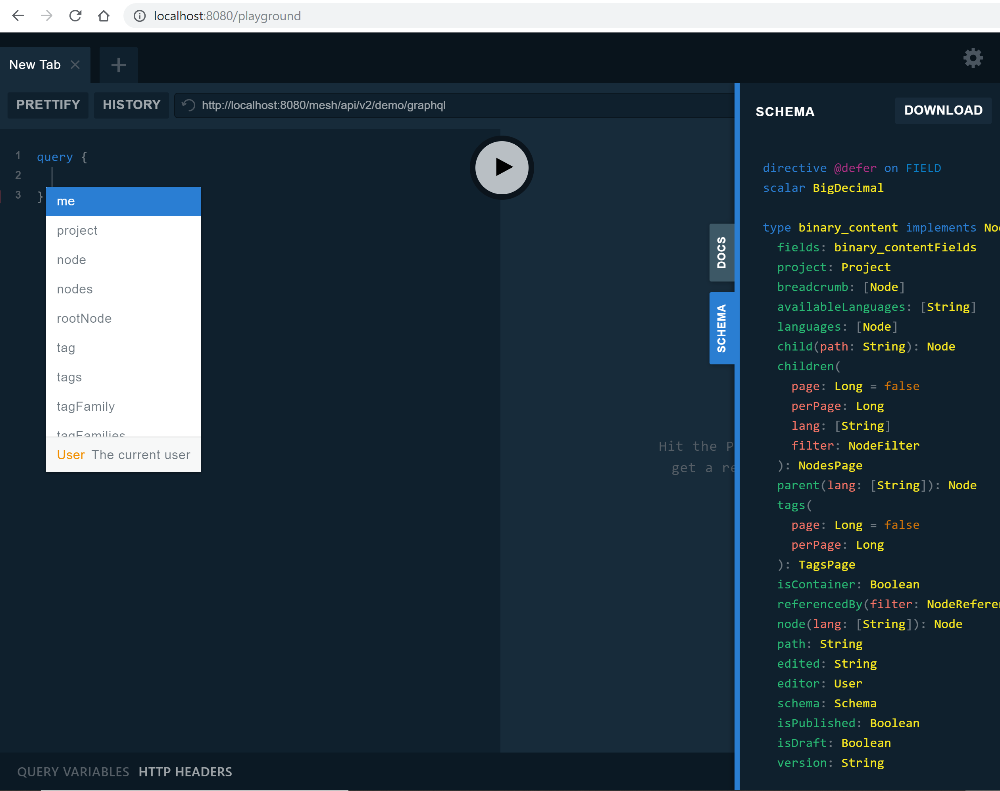

# Mesh-Gateway  

Mesh-Gateway is a simple gateway/proxy for the awesome Gentics Mesh headless CMS.  

It provides a transparent proxy to the backend, and allows for intercepting the request/response payloads for transformation or hooks.  

## Quickstart  
- Clone this repo
- Run `gradlew bootRun` on Mac/Linux or `gradlew.bat bootRun` on Windows.  
- To access the Mesh api: [http://localhost:8080/mesh/api/v2](http://localhost:8080/mesh/api/v2)  
- To access the graphql-playgound: [http://localhost:8080/playground]

GraphQL-Playground is embedded for discovery and debugging graph queries.  
This is provided by a starter plugin [https://github.com/graphql-java-kickstart/graphql-spring-boot#enable-graphql-playground]  
Read more about GraphQL-Playground [https://github.com/prisma/graphql-playground]  

Using 'auto-complete' by schema introspection in playground  
  

## Development 
Java 8+ required.  
This is a Spring Boot app, so you can customize the `./src/main/resources/application.yml` particularly to change the destination host. It points to the Gentics Mesh demo site by default.  

The Greenwich branch is used to get the `org.springframework.cloud:spring-cloud-gateway-mvc` dependency.  
```
dependencyManagement {
    imports {
        mavenBom "org.springframework.cloud:spring-cloud-dependencies:Greenwich.SR2"
    }
}
```

